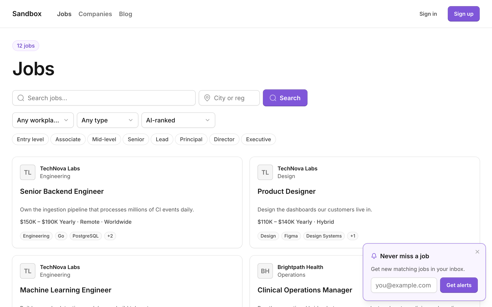

# cavuno-shadcn-ui-job-board-template

An open-source (MIT) job board template built entirely from
[Untitled UI React](https://www.untitledui.com/react) (free set) and
[Tailwind CSS 4](https://tailwindcss.com). Clone it, run it, and you have a
complete, SEO-ready job board — every surface a real page, nothing stubbed.



**Stack**: React 19 · TanStack Start (SSR) · Cloudflare Workers · Vite+
(`vp`) · Tailwind CSS 4 · Untitled UI React.

## What you get

- **The full free Untitled UI collection, in-tree** — 230+ component files
  under `src/components`, added the way the CLI adds them
  (`npx untitledui@latest add …`), yours to edit. No design tokens hidden
  behind a package.
- **Every surface is a real page**, not a placeholder: jobs browse + search
  + filters, job detail + apply, companies, blog, salary explorer,
  programmatic SEO listings, candidate auth + account + messaging, the
  employer app, and embeds.
- **SEO built in** — canonical URLs, `JobPosting` JSON-LD (Google for Jobs),
  `sitemap.xml`, `robots.txt`, blog `rss.xml`, and OpenGraph images.
- **i18n chrome** — [Paraglide JS](https://paraglidejs.com) with `en`/`de`/`fr`
  catalogs (UI chrome only; board content stays its own language).
- **Dark mode** keyed to a single `.dark` class, and **accessibility** from
  the react-aria foundations every Untitled UI component is built on.

## Quickstart

```sh
git clone https://github.com/wollemiahq/cavuno-shadcn-ui-job-board-template
cd cavuno-shadcn-ui-job-board-template
pnpm install
pnpm dev            # http://localhost:3000
```

With **zero config** it renders the platform **sandbox board** — a live,
deterministic fixture tenant you can safely try everything on (applying,
alert signups) that resets nightly. No keys, no account, no setup.

**Point it at your own board** by swapping one value, `CAVUNO_BOARD`, for
your board's `pk_…` publishable key (`.dev.vars` in dev, `wrangler.jsonc`
in production):

| Variable | What | Example |
|---|---|---|
| `CAVUNO_API_URL` | Board API base URL | `https://api.cavuno.com` |
| `CAVUNO_BOARD` | Your board's publishable key | `pk_…` (Dashboard → Settings → API) |

The reveal: the data layer is the **[Cavuno Board API](https://cavuno.com)**
(`@cavuno/board`) — a hosted job-board backend (jobs, companies, salaries,
applications, alerts, auth). The `pk_…` key is client-safe by design; user
sessions live in a host-owned httpOnly cookie this app manages itself.
Deploy with `pnpm run deploy` (Cloudflare Workers).

## Design system

This is **stock Untitled UI**: Inter, their `theme.css` + `typography.css`,
their react-aria base components under `src/components/base/`, class merging
via `cx` from `@/utils/cx`. Nothing is aliased or re-skinned.

Rebrand the way Untitled UI documents — edit the `--color-brand-*` ramp
(and the neutral scale) in `src/styles/untitled-ui/theme.css`. That is the
supported theming path. A legacy runtime `BoardTheme` SDK override
(`@cavuno/board/theme`, injected in `src/routes/__root.tsx`) still ships but
is deprecated-bound; treat `theme.css` as canonical.

The full component inventory, token reference, and design do's-and-don'ts
live in **`DESIGN.md`** (generated from `src/tokens.css` + component source —
regenerate with `pnpm run gen:design`, never hand-edit; CI rejects drift).

## What's inside

| Surface | Route(s) |
|---|---|
| Jobs (hero + search + filters + load more) | `/` |
| Job detail (meta + Google for Jobs JSON-LD) | `/companies/:companySlug/jobs/:jobSlug` |
| Programmatic listings | `/jobs/:keyword`, `/jobs/skills/:skill`, `/jobs/locations/:location` |
| Companies | `/companies`, `/companies/:companySlug`, `/companies/markets/:market` |
| Salaries | `/salaries` + company/title/skill/location trees |
| Talent | `/talent`, `/p/:handle` |
| Blog (+ tags, authors) | `/blog`, `/blog/:postSlug`, `/blog/tag/:tagSlug`, `/blog/author/:authorSlug` |
| Auth, account, employer, messaging | `/auth/*`, `/account`, `/employers/*`, `/messages` |
| SEO artifacts | `/sitemap.xml`, `/robots.txt`, `/blog/rss.xml` |

Job-detail URLs mirror Cavuno's hosted board so a board migrating
hosted → headless keeps its indexed URLs.

## Real-data discipline

The starter is wired to a live, forager-ingested board, so the design
handles messy data by construction: long titles clamp to keep card rhythm,
absent salaries are omitted (never an empty label), 10–15 skill tags cap at
3 + honest `+N`, missing logos fall back to initials, and one-line summaries
are the real first sentence of the real description or omitted — never
invented about a real employer. The full stress pass (production robotics
board, 937 jobs, light + dark, CJK, sparse profiles) is recorded in
[`docs/stress-log.md`](docs/stress-log.md).

## Upkeep

- **`.github/workflows/ci.yml`** — typecheck, test, build, structural
  import gates, plus `npx cavuno-board doctor` (static + read probes against
  the built worker + write probes against the platform sandbox). Doctor is
  the conformance gate: capability, not markup.
- **`.github/workflows/update.yaml`** — the reusable
  [`cavuno-update-action`](https://github.com/wollemiahq/cavuno-update-action):
  weekly it bumps `@cavuno/*`, rebuilds, runs doctor, lets a coding agent
  fix breaking changes, and opens a PR.

## Internationalization (Paraglide JS)

Multi-language **chrome** is wired with [Paraglide JS](https://paraglidejs.com)
— compile-time, no runtime provider, TanStack-native. The board's content
stays its single language; only the UI chrome localizes.

- **Messages come from the SDK catalog, never hand-authored.**
  `pnpm run gen:messages` regenerates `messages/{en,de,fr}.json` from
  `@cavuno/board`'s `uiCopy` catalog — run it after a board SDK bump.
- The Paraglide Vite plugin compiles those into tree-shakeable functions in
  `src/paraglide/` (generated, gitignored) on every build.

Path-prefixed `/de/` `/fr/` routing, SSR locale middleware, and per-locale
`hreflang`/sitemap are guided by the `cavuno-board-i18n` skill
(`npx @cavuno/board setup`). Content translation is out of scope.

## Version pinning

`@cavuno/board` and `vite-plus` are pinned **exact**. npm's
`min-release-age` policy silently resolves `@cavuno/board@latest` down to an
old version, so exact pins are load-bearing, not stylistic.

## Tests

```sh
pnpm test        # vitest via vp: session codec, theme mapper, JSON-LD,
                 # copy-seam guard, view-models, derived-summary stress cases
pnpm run typecheck
pnpm run build
```
