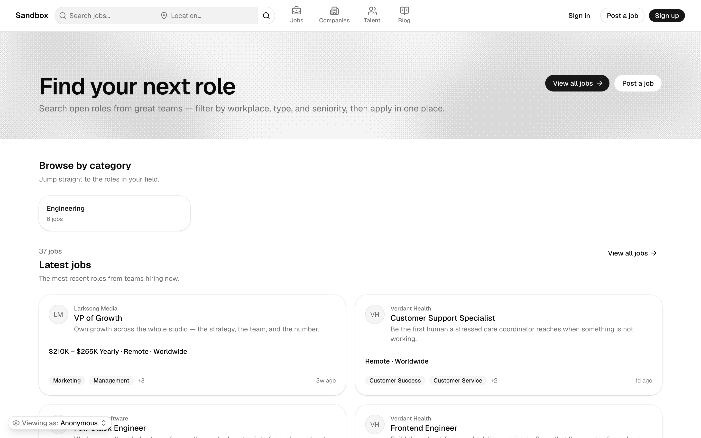
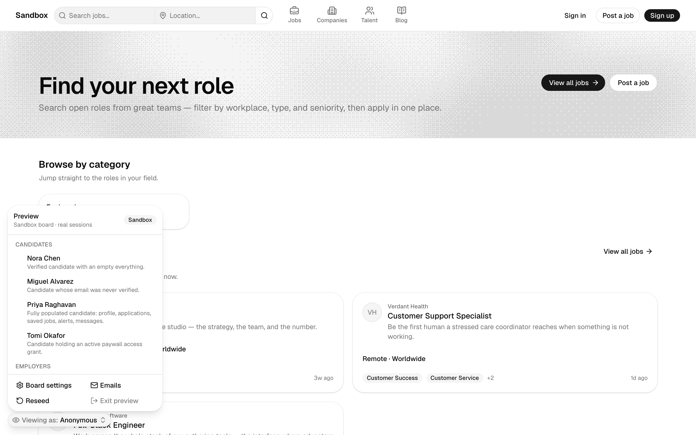
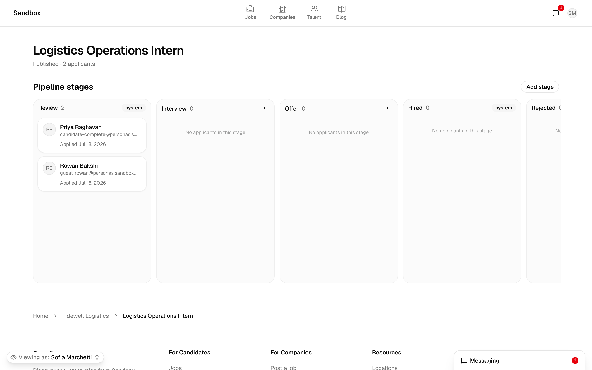
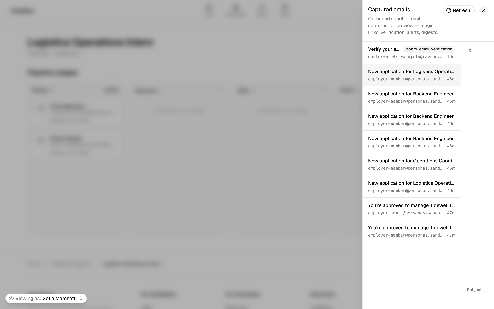

# Cavuno — a job board template that runs the moment you clone it

**Clone it, `pnpm dev`, and in under a minute you have a populated,
production-realistic job board** — real jobs and companies, a working
applicant tracker, captured outbound emails, and Stripe test-mode checkout.
No API key, no account, and no empty database to seed first.

Built on TanStack Start, Cloudflare Workers, and the official
**shadcn/ui Rhea** preset on **Base UI**. Data comes from the hosted
[Cavuno Board API](https://cavuno.com) (`@cavuno/board`), so every surface is
a real page wired to a real backend — not a mock.

> **Hosted demo:** `<DEMO_URL>` — _placeholder; see [Deploy](#deploy). The demo
> deploy target exists (`wrangler deploy --env demo`) but the public URL is the
> owner's go-live decision._



<!-- Screenshots referenced below live in docs/media/ and must be captured
     before release — see docs/media/README.md for the exact shot list. -->

---

## Why this template is different

Most job-board templates hand you a beautiful shell and then ask you to
"insert your API key and seed a database." You clone, you configure, you stare
at an empty board. This one leads with two things instead:

### 1. A zero-setup running product

`.dev.vars.example` already points at the **platform sandbox board** — a live,
deterministic fixture tenant that resets nightly and is safe to write to. So a
fresh clone boots straight into a full board with:

- **8 seeded scenario personas** you switch between from a **developer preview
  toolbar** (bottom-left, sandbox-only) — new candidates, verified candidates,
  premium/granted candidates, and employers from "just signed up" through
  "workspace admin with a live applicant pipeline." Switching sets a **real
  session cookie**, so you see each state exactly as that user would.
- **A working ATS** — the employer applicant pipeline is a real **kanban
  board** (columns are stages, cards are applicants) with pointer **and**
  keyboard drag-and-drop and optimistic moves.
- **Captured outbound email** — a `letter_opener`-style viewer over every email
  the board would send (magic-link sign-in, verification, password reset,
  alert double-opt-in). The sandbox captures instead of delivering, so every
  flow that "continues in your inbox" is completable on the spot.
- **Payments that work with Stripe test cards** — the sandbox runs Stripe
  **test mode**, so the candidate paywall and the job-posting funnel accept
  `4242 4242 4242 4242` with **no Stripe account or keys of your own.**

The full sandbox playbook — persona roster, feature-flag toggles, reseed, and
the headless server-function equivalents — is in
[`docs/preview-states.md`](docs/preview-states.md). A short guided tour is in
[`docs/DEMO.md`](docs/DEMO.md).

### 2. Agent-ready by construction

[`AGENTS.md`](AGENTS.md) is a machine-readable contract that any coding agent —
the hosted Cavuno builder, a tenant's own agent, or a fleet run — reads before
touching the repo. It works because the codebase is layered so that
correctness can't be redesigned away:

- **Layer 1a — the `@cavuno/board` SDK**: formatters, path helpers,
  breadcrumbs, copy. The correctness functions.
- **Layer 1b — view-model mappers** (`src/board/**`): pure functions
  (`toJobCardVM`, `toJobDetailVM`, …) that call the SDK and hand components
  plain, resolved data.
- **Layer 2 — presentation** (`src/components/**`): dumb, typed-props
  components you can restructure freely without ever mis-calling a formatter.

That separation is what makes this one of the first genuinely
**agent-buildable** job-board templates: an agent can redesign the surface
without breaking salary math, canonical URLs, or SEO.

---

## Quickstart

```sh
git clone https://github.com/wollemiahq/cavuno-shadcn-ui-job-board-template
cd cavuno-shadcn-ui-job-board-template
cp .dev.vars.example .dev.vars   # already points at the live sandbox board
pnpm install
pnpm dev                         # http://localhost:3000
```

That's it. No keys, no account, no database. The dev server boots on the
**sandbox board** and the preview toolbar appears bottom-left — start switching
personas.

> Requires **pnpm 11** (pinned in `package.json`) and Node 24 (matches CI).

**Point it at your own board** by swapping one value — `CAVUNO_BOARD` — for
your board's `pk_…` publishable key (`.dev.vars` in dev, `wrangler.jsonc` vars
in production). Nothing else changes.

| Variable | What | Where |
|---|---|---|
| `CAVUNO_API_URL` | Board API base URL (`https://api.cavuno.com`) | `.dev.vars` / `wrangler.jsonc` |
| `CAVUNO_BOARD` | Your board's `pk_…` publishable key (Dashboard → Settings → API) | `.dev.vars` / `wrangler.jsonc` |

The `pk_…` key is **client-safe by design**; user sessions live in a
host-owned httpOnly cookie this app manages itself. The Board API is only ever
called server-side (`src/server/**`).

---

## Take the tour

The sandbox exists so you can see every state without seeding anything. The
full script with exact clicks is in [`docs/DEMO.md`](docs/DEMO.md); the short
version:

1. **Switch personas** — toolbar → **Employers → `employer-admin`**. You are
   now signed in as a workspace admin.
2. **Drag a card across the kanban** — open a job's applicants and move a
   candidate between pipeline stages (mouse or keyboard).
3. **Read a captured email** — toolbar → **Emails** to see the outbound mail
   the board just produced, rendered in full.
4. **Check out with a test card** — trigger the candidate paywall or the
   job-posting funnel and pay with `4242 4242 4242 4242`. No Stripe setup.





---

## What's inside

Every surface is a real, SSR-rendered page wired to the Board API:

| Surface | Route(s) |
|---|---|
| Home (company discovery + latest jobs) | `/` |
| Jobs search (filters + master/detail) | `/jobs` |
| Job detail (meta + Google for Jobs JSON-LD) | `/companies/:companySlug/jobs/:jobSlug` |
| Programmatic SEO listings | `/jobs/:keyword`, `/jobs/skills/:skill`, `/jobs/locations/:location` |
| Companies | `/companies`, `/companies/:companySlug`, `/companies/markets/:market` |
| Salaries explorer | `/salaries` + company/title/skill/location trees |
| Talent directory | `/talent`, `/p/:handle` |
| Blog (+ tags, authors, RSS) | `/blog`, `/blog/:postSlug`, `/blog/tag/:tagSlug`, `/blog/author/:authorSlug` |
| Candidate auth, account, saved jobs, messaging | `/auth/*`, `/account`, `/settings`, `/messages` |
| Employer app (dashboard, jobs, **applicant pipeline**) | `/employers/*` |
| Post a job (anonymous funnel) | `/post` |
| Embeds | `/embed/jobs` |
| SEO artifacts | `/sitemap.xml`, `/robots.txt`, `/blog/rss.xml` |

Cross-cutting capabilities that ship on top of those routes:

- **SEO built in** — canonical URLs, `JobPosting` JSON-LD (Google for Jobs),
  `sitemap.xml`, `robots.txt`, blog RSS, and OpenGraph images. Job-detail URLs
  mirror Cavuno's hosted board, so a board migrating hosted → headless keeps
  its indexed URLs.
- **Real-data discipline** — the design handles messy data by construction:
  long titles clamp, absent salaries are omitted (never an empty label), skill
  tags cap at `3 + N`, missing logos fall back to initials. See
  [`docs/stress-log.md`](docs/stress-log.md).
- **i18n chrome** — [Paraglide JS](https://paraglidejs.com) with `en`/`de`/`fr`
  catalogs, compile-time, SSR-native. UI chrome only; board content stays its
  own language.
- **Dark mode** keyed to a single `.dark` class, and **accessibility** from
  Base UI semantics and the owned components' explicit ARIA contracts.

---

## Tech stack

| Layer | Choice |
|---|---|
| Framework | [TanStack Start](https://tanstack.com/start) (SSR) on React 19 |
| Runtime | [Cloudflare Workers](https://workers.cloudflare.com) |
| Build | Vite+ (`vp`) |
| UI | [shadcn/ui Rhea](https://ui.shadcn.com) on [Base UI](https://base-ui.com), Tailwind CSS 4, Geist, Lucide |
| Data | [`@cavuno/board`](https://cavuno.com) — hosted job-board backend SDK |
| i18n | [Paraglide JS](https://paraglidejs.com) |

Exact versions are in [`package.json`](package.json). `@cavuno/board` and
`vite-plus` are pinned **exact** on purpose — npm's `min-release-age` policy
would otherwise silently resolve `@latest` down to an older version.

---

## Customize it

This is a **customization template**, not a scaffold to rebuild. The contract
that keeps customizations safe:

- **[`AGENTS.md`](AGENTS.md)** — the rules any contributor (human or agent)
  follows: the customization surface, the layering, and the hard rules.
- **[`DESIGN.md`](DESIGN.md)** — the visual identity, design tokens, and the
  full component inventory (generated from `src/theme.css` + component source;
  never hand-edited).
- **[`docs/patterns/`](docs/patterns/README.md)** — page-level compositions.
  Select a pattern before composing a route; never hand-roll a
  listing/detail/form/empty surface.

The design-system source is the current official shadcn/ui Rhea preset; the
Base UI-backed primitives under `src/components/ui/` and their CLI-owned theme
(`src/theme.css`) are yours to edit or replace. The full theming and preset
workflow lives in [`DESIGN.md`](DESIGN.md).

---

## Deploy

The template targets **Cloudflare Workers** (config in
[`wrangler.jsonc`](wrangler.jsonc)).

```sh
pnpm run deploy            # builds, then `wrangler deploy`
```

A `demo` environment is pre-wired for the hosted showcase deploy:

```sh
wrangler deploy --env demo
```

> The public demo URL (`<DEMO_URL>` above) is intentionally a placeholder —
> flipping it live is the owner's decision. See [`docs/publish-gate.md`](docs/publish-gate.md)
> for the current release status.

[](https://deploy.workers.cloudflare.com/?url=https://github.com/wollemiahq/cavuno-shadcn-ui-job-board-template)

<!-- The Deploy button above works once the repo is public; while private it
     will not resolve for external visitors. -->

---

## Verify

Every change runs the verify triad before it lands (CI enforces the same):

```sh
pnpm run typecheck && pnpm test && pnpm run build
```

The full local gate, including formatting, design-artifact drift, and the Board
API conformance probe (`cavuno-board doctor`), is documented in
[`CONTRIBUTING.md`](CONTRIBUTING.md) and [`docs/testing.md`](docs/testing.md).

---

## Contributing & license

- **[CONTRIBUTING.md](CONTRIBUTING.md)** — how to run, the verify triad, the
  `AGENTS.md` contract, and PR expectations.
- **[CODE_OF_CONDUCT.md](CODE_OF_CONDUCT.md)** — Contributor Covenant.
- **License:** [MIT](LICENSE).
